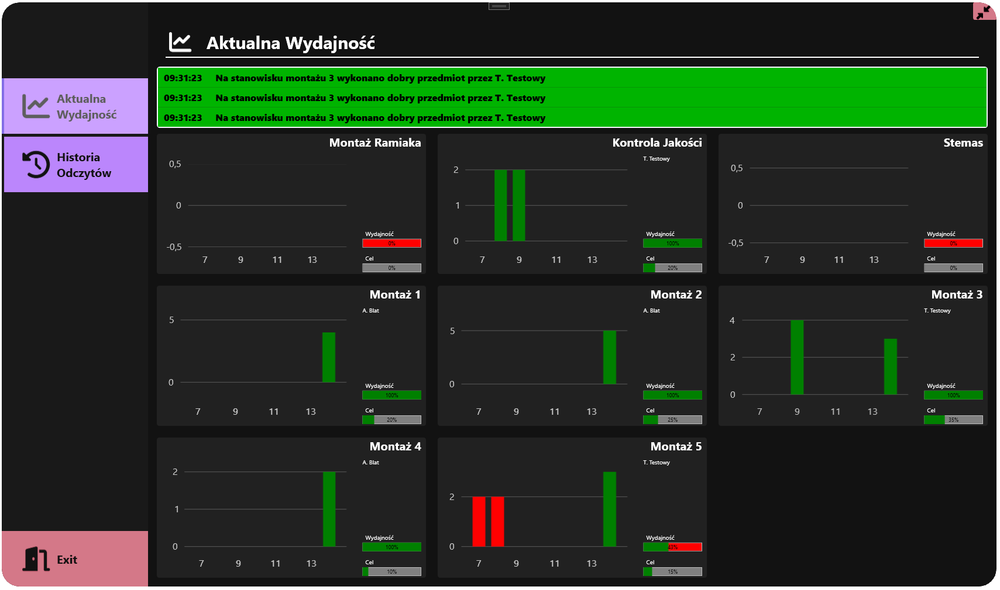
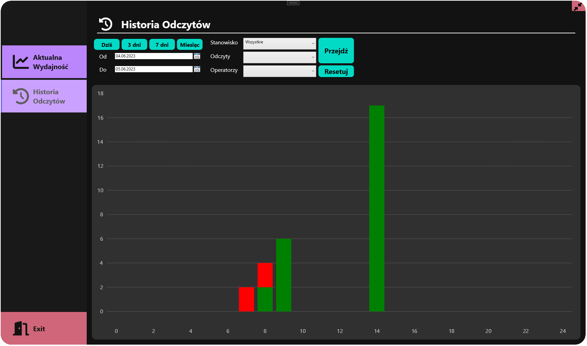

# Illustro
### Wykresy wydajnoœci tworzone w czasie rzeczywistym.

## Technologie
* .NET 7.0
* WPF
* EntityFrameworkCore
* FontAwesome.Sharp
* LiveChartsCore

## Opis
Program ³¹czy siê z baz¹ danych MSSQL i na podstawie odczytów dokonywanych na ¿ywo na innych stanowiskach tworzy wykresy.
W zale¿noœci od stanowiska, statusu odczytu (dobry/z³y) oraz godziny tworzony jest wykres.
Na podstawie wykresów kadra kierownicza mo¿e wyci¹gn¹æ wnioski z wydajnoœci na ka¿dym stanowisku.
W zak³adce "Historia Odczytów" mo¿na stworzyæ wykres z ubieg³ych dni, b¹dŸ z konkretnego zakresu czau jak i równie¿ na wybraæ stanowisk.

